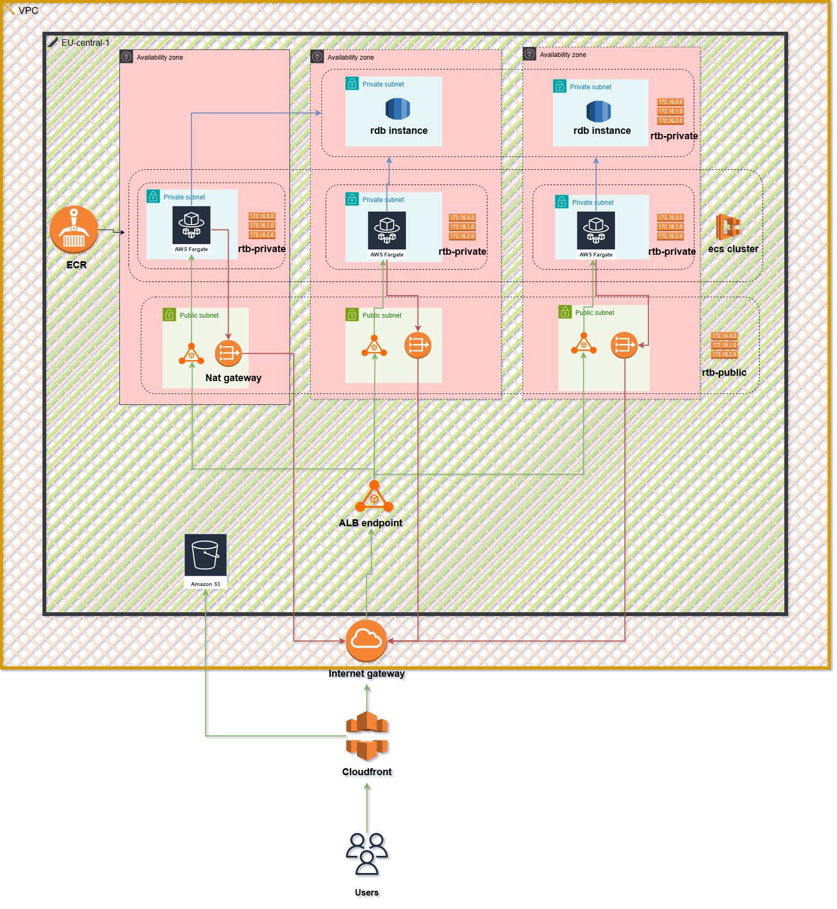

# High-level Architecture

### 1.1  Motivation
* **Stateless containers** on ECS Fargate → no host maintenance.  
* **ALB** in front for in-region distribution of traffic (eu-central-1) to ecs tasks which are in private subnets across multiple AZs.  
* **CloudFront** for global HTTPS, edge caching and origin shielding.  
* **RDS PostgreSQL (Multi-AZ)** for data durability.  
* **S3 + OAC** for static assets, private to CloudFront.
* **Nat gateway** to forward traffic from ECS fargate containers in the private subnets to "0.0.0.0".
* **Internet gateway** to allow comunication between the VPC and "0.0.0.0"

### 1.2  Request flow
1. **HTTPS** ↗ CloudFront (`dxxxxx.cloudfront.net`).  
2. Static objects (`/static/...`) are served from the S3 origin, everything else is forwarded to the ALB.  
3. ALB (public subnets) forwards to **ECS tasks** (private subnets, port 8000).  
4. Tasks use **Secrets Manager** to fetch the DB password, then connect to RDS through IAM roles "ecsTaskExectionRole".

### 1.3  AZ layout
| AZ | Public subnet     | Private subnet  ECS   | private subnet DB  |
|----|-------------------|-----------------------|--------------------|
| a  | ALB + NAT (GW-a)  | ECS tasks A,          |                    |
| b  | ALB + NAT (GW-b)  | ECS tasks B,          |                    |
| c  | ALB + NAT (GW-c)  | ECS tasks C           |                    |
| d  |                   |                       | RDS a              |
| e  |                   |                       | RDS b              |

### 1.4 Route tables
| Route table | Subnet Association | Target |
|-------------|--------------------|--------|
|rtb-public   |  public subnet a,b,c| IGW   |
|rtb-private  |  private subnet a   | NAT (GW-a) |
|rtb-private  |  private subnet b   | NAT (GW-b) |
|rtb-private  |  private subnet c   | NAT (GW-c) |
|rtb-private  |  private db subnet d,e | None |

### 1.5  Security summary
* **SGs**: `alb_sg` ↔ `ecs_sg`, `ecs_sg` ↔ `rds_sg`.
* **IAM**:  
  * GitHub OIDC role (least-privilege, see 02-infrastructure).  
  * Task-role (ecsTaskExecutionRole) with `s3:GetObject`, `secretsmanager:GetSecretValue`.  
* **Data at rest**: S3 SSE-S3, RDS default encryption.
