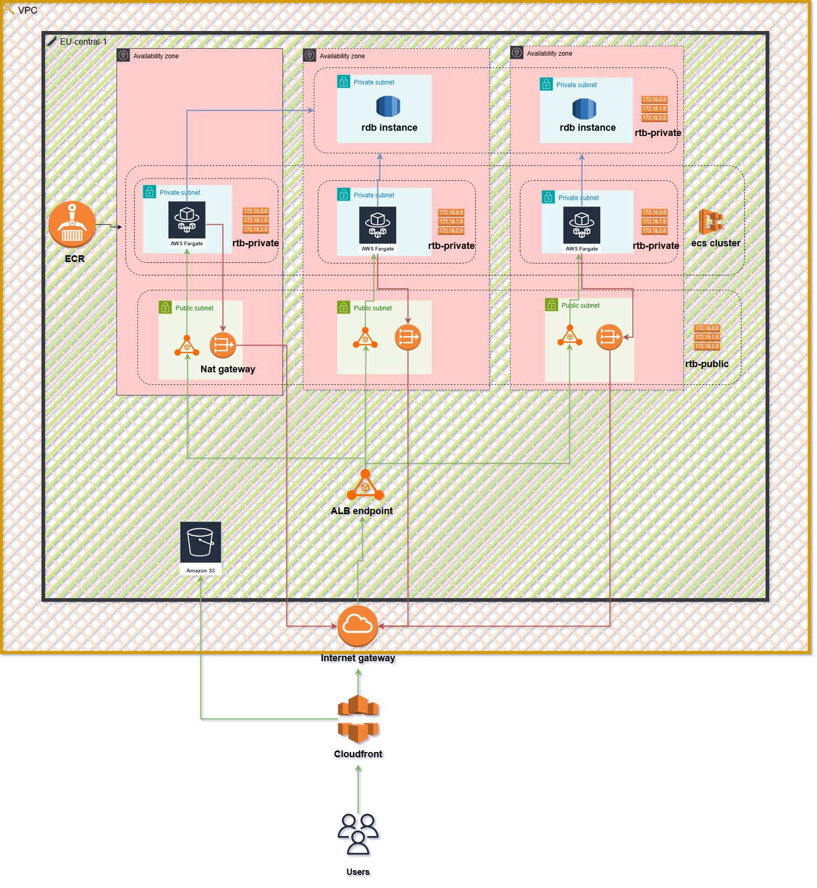

# High-level Architecture

### 1.1  Motivation
* **Stateless containers** on ECS Fargate → no host maintenance.  
* **ALB** in front for in-region TLS (ACM eu-central-1).  
* **CloudFront** for global HTTPS, edge caching and origin shielding.  
* **RDS PostgreSQL (Multi-AZ)** for data durability.  
* **S3 + OAC** for static assets, private to CloudFront.

### 1.2  Request flow
1. **HTTPS** ↗ CloudFront (`dxxxxx.cloudfront.net`).  
2. Static objects (`/static/...`) are served from the S3 origin, everything else is forwarded to the ALB.  
3. ALB (public subnets) forwards to **ECS tasks** (private subnets, port 8000).  
4. Tasks use **Secrets Manager** to fetch the DB password, then connect to RDS.

### 1.3  AZ layout
| AZ | Public            | Private               |
|----|-------------------|-----------------------|
| a  | ALB + NAT (GW-a)  | ECS tasks A, RDS a    |
| b  | NAT (GW-b)        | ECS tasks B, RDS standby |
| c  | NAT (GW-c)        | ECS tasks C           |

### 1.4  Security summary
* **SGs**: `alb_sg` ↔ `ecs_sg`, `ecs_sg` ↔ `rds_sg`.
* **IAM**:  
  * GitHub OIDC role (least-privilege, see 02-infrastructure).  
  * Task-role with `s3:GetObject`, `secretsmanager:GetSecretValue`.  
* **Data at rest**: S3 SSE-S3, RDS default encryption.
